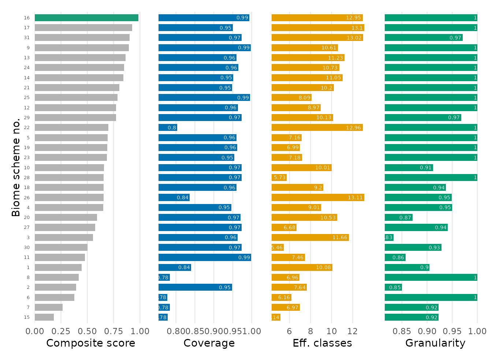

# Step 2: Choosing a biome scheme

## Goal

[Step
1](https://azizka.github.io/biomes/articles/step1-occurrence-records-and-biome-schemes.md)
gave us occurrence records and the 31 biome schemes. With 31 schemes to
choose from, this step picks the one that best fits *your* data, so the
choice is explicit and reproducible rather than defaulting to a familiar
scheme.

> **Terms.** A **biome scheme** is one of the 31 classification systems;
> a **biome class** is a category within it; a **biome scheme number**
> (1-31) identifies a scheme. The `scheme_type` argument groups schemes
> by methodology.

------------------------------------------------------------------------

## 1. Rank the schemes for your data

[`biomes_rank()`](https://azizka.github.io/biomes/reference/biomes_rank.md)
scores every scheme for your occurrences and proposes a single
best-fitting scheme. Each scheme is rated on three complementary,
data-driven criteria:

- **coverage**: share of records that fall on a defined biome class.
- **effective number of classes**: `exp(H')`, the effective number of
  biome classes the records occupy (rewards schemes that spread the data
  over several well-populated classes).
- **granularity**: occupied biome classes divided by the total number of
  biome classes in the scheme.

The three criteria are min-max scaled to `[0, 1]` and averaged (equal
weights) into a **composite score**. The best-scoring scheme is returned
in `attr(ranking, "best_scheme")`.

``` r

ranking <- biomes_rank(biomes_example, verbose = FALSE)
best    <- attr(ranking, "best_scheme")
best
#> [1] 16
head(ranking)
#>   scheme
#> 1      1
#> 2      2
#> 3      3
#> 4      4
#> 5      5
#> 6      6
#>                                                                                                                  scheme_name
#> 1                                                                       Global vegetation patterns of the past 140,000 years
#> 2                                                  Dataset of the global component of the Copernicus Land Monitoring Service
#> 3                                            Present and future Köppen-Geiger climate classification maps at 1-km resolution
#> 4 Global mapping of potential natural vegetation: an assessment of machine learning algorithms for estimating land potential
#> 5                                                       An ecoregion-based approach to protecting half the terrestrial realm
#> 6                                              A global classification of vegetation based on NDVI, rainfall and temperature
#>   year n_total n_hit n_na pct_na coverage_raw coverage_scaled
#> 1 2020   29104 24452 4652  15.98    0.8401594       0.2844065
#> 2 2019   29104 27587 1517   5.21    0.9478766       0.7708301
#> 3 2018   29104 28023 1081   3.71    0.9628573       0.8384794
#> 4 2018   29104 27538 1566   5.38    0.9461930       0.7632273
#> 5 2017   29104 27943 1161   3.99    0.9601086       0.8260667
#> 6 2017   29104 22619 6485  22.28    0.7771784       0.0000000
#>   effective_classes_raw effective_classes_scaled granularity_raw
#> 1             10.080182                0.6202006       0.9047619
#> 2              7.637310                0.3138203       0.8500000
#> 3             11.659664                0.8182963       0.8333333
#> 4              9.012508                0.4862950       0.9500000
#> 5              7.159880                0.2539420       1.0000000
#> 6              6.163172                0.1289367       1.0000000
#>   granularity_scaled composite_score rank is_best
#> 1          0.4285714       0.4443928   26   FALSE
#> 2          0.1000000       0.3948835   28   FALSE
#> 3          0.0000000       0.5522586   23   FALSE
#> 4          0.7000000       0.6498408   20   FALSE
#> 5          1.0000000       0.6933362   13   FALSE
#> 6          1.0000000       0.3763122   29   FALSE
```

The result is a data frame with one row per scheme; the key columns are
`scheme` (the biome scheme number), `scheme_name`, `composite_score` and
`is_best`.

#### Rank within a conceptually comparable group

Comparing schemes of different methodologies can mislead, so restrict
the ranking to one group with `scheme_type`:

``` r

r_veg <- biomes_rank(biomes_example, scheme_type = "vegetation", verbose = FALSE)
attr(r_veg, "best_scheme")
#> [1] 9

table(biomes_information$scheme_type)   # how many schemes per group
#> 
#> anthropogenic       climate     ecoregion   integrative    land_cover 
#>             1             8             4             5             7 
#>    vegetation 
#>             6
```

`scheme_type = "all"` (the default) ranks all 31 schemes. Other groups
are `"climate"`, `"vegetation"`, `"land_cover"`, `"ecoregion"`,
`"integrative"` and `"anthropogenic"`.

------------------------------------------------------------------------

## 2. Inspect the ranking

The `rank` panel of
[`biomes_visualise()`](https://azizka.github.io/biomes/reference/biomes_visualise.md)
shows the composite score per scheme with the best scheme highlighted:

``` r

biomes_visualise(biomes_example, panels = "rank")
```



Treat the ranking as a **shortlist**, not an authoritative answer: the
most suitable scheme ultimately depends on your research question.
Inspect the criterion-specific columns of the ranking and use
[`biomes_info()`](https://azizka.github.io/biomes/reference/biomes_info.md)
to pick the scheme whose concept and resolution match your data.

The integer in `attr(ranking, "best_scheme")` is exactly the biome
scheme number you pass as `scheme` to the classification and
visualisation functions next.

------------------------------------------------------------------------

## Next

You have a chosen biome scheme. Continue with [Step 3:
Occurrences-to-biome
classification](https://azizka.github.io/biomes/articles/step3-occurrence-to-biome-classification.md).
